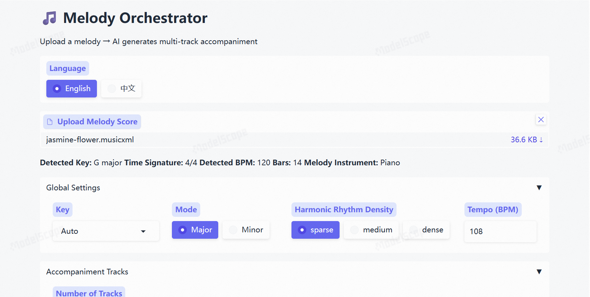

# 🎵 Melody Orchestrator

[](https://www.modelscope.cn/studios/JeffreyZhou2026/Melody_Orchestrator_03/)
[](https://www.python.org/)
[](https://gradio.app/)
[](LICENSE)

**An AI-powered multi-track accompaniment generator for monophonic melodies.**

Upload a single-line melody (MusicXML/MXL/MIDI), and the system automatically generates a full multi-instrument accompaniment with intelligent orchestration.

---

## 🌟 Features

- **🎵 Melody Input**: Upload MusicXML, MXL, or MIDI files containing a single-line melody
- **🎹 Multi-Track Accompaniment**: Generate 1-N accompaniment tracks with 88 GM instruments
- **🤖 Dual AI Models**: 
  - **AutoHarmonizer**: Generates chord progressions from melody
  - **METEOR**: Creates multi-track orchestral arrangements
- **🎛️ Customizable Parameters**:
  - Key and Mode (Major/Minor)
  - Harmonic Rhythm Density (Sparse/Medium/Dense)
  - Per-track instrument selection
  - Advanced: Rhythmic Intensity, Polyphonicity, Pitch Range
- **📄 Multiple Output Formats**: MusicXML, MXL, MIDI
- **🌐 Bilingual UI**: English/Chinese interface

---

## 🎬 Demo

**Try it online**: [ModelScope Space](https://www.modelscope.cn/studios/JeffreyZhou2026/Melody_Orchestrator_03/) https://www.modelscope.cn/studios/JeffreyZhou2026/Melody_Orchestrator_03/

### Screenshot



---

## 🏗️ Architecture

```
[User Upload: MusicXML/MXL/MIDI Melody]
                │
                ▼ (music21: extract melody + beat/key)
    ┌───────────────────────────┐
    │   AutoHarmonizer (TF)     │
    │   Melody → Chord Sequence │
    └───────────────────────────┘
                │
                ▼ (Chord symbols → Block chords MIDI)
    ┌───────────────────────────┐
    │   Intermediate 2-Track    │
    │   Track 0: Melody         │
    │   Track 1: Block Chords   │
    └───────────────────────────┘
                │
                ▼ (REMI+ tokenization)
    ┌───────────────────────────┐
    │   METEOR (PyTorch)        │
    │   2-Track → Multi-Track   │
    └───────────────────────────┘
                │
                ▼
    ┌───────────────────────────┐
    │   Final Output            │
    │   MusicXML/MXL/MIDI       │
    │   Melody + Accompaniment  │
    └───────────────────────────┘
```

---

## 🎼 Instrument Support

Supports **88 General MIDI instruments** across categories:

| Category         | Instruments                                                  |
| ---------------- | ------------------------------------------------------------ |
| **Keyboards**    | Acoustic Grand Piano, Electric Piano, Harpsichord, Clavinet, Celesta, etc. |
| **Organs**       | Drawbar Organ, Church Organ, Accordion, Harmonica, etc.      |
| **Guitars**      | Acoustic Guitar (Nylon/Steel), Electric Guitar, etc.         |
| **Basses**       | Acoustic Bass, Electric Bass, Synth Bass, etc.               |
| **Strings**      | Violin, Viola, Cello, Contrabass, String Ensemble, etc.      |
| **Brass**        | Trumpet, Trombone, Tuba, French Horn, Brass Section, etc.    |
| **Woodwinds**    | Flute, Oboe, Clarinet, Bassoon, Saxophones, etc.             |
| **Synthesizers** | Synth Lead, Synth Pad, Synth Brass, etc.                     |
| **Ethnic**       | Sitar, Banjo, Shamisen, Koto, Kalimba, etc.                  |

Each instrument has musicologically accurate profiles:

- Appropriate clef (Treble/Bass/Alto)
- Typical pitch range
- Monophonic vs Polyphonic capability

---

## 🚀 Installation

### Prerequisites

- Python 3.10
- TensorFlow 2.10+ (for AutoHarmonizer)
- PyTorch 2.0+ (for METEOR)

### Setup

```bash
# Clone the repository
git clone https://github.com/JeffreyZhou2026/MelodyOrchestrator.git
cd MelodyOrchestrator/MelodyOrchestrator-ModelScope01

# Install dependencies
pip install -r requirements.txt

# Run the application
python app.py
```

### Model Weights

- **AutoHarmonizer**: `weights.hdf5` (included in repository)
- **METEOR**: Automatically downloaded from [ModelScope](https://www.modelscope.cn/models/JeffreyZhou2026/meteor_checkpoint/) on first run

---

## 📖 Usage

1. **Upload Melody**: Upload a MusicXML, MXL, or MIDI file containing a single-line melody
2. **Configure Settings**:
   - Select number of accompaniment tracks (1-8)
   - Choose instruments for each track
   - Set key, mode, and harmonic density
3. **Generate**: Click "Generate Accompaniment" and wait for processing
4. **Download**: Download the result in MusicXML, MXL, or MIDI format

### Advanced Settings

Each track can be fine-tuned with:

- **Rhythmic Intensity** (0-7): Controls note density per bar
- **Polyphonicity** (0-7): Controls simultaneous notes per beat
- **Average Pitch** (0-130): Controls register placement
- **Pitch Diversity** (0-12): Controls melodic complexity

---

## 🔧 Technical Details

### Models

| Model          | Parameters | Framework  | Purpose                      |
| -------------- | ---------- | ---------- | ---------------------------- |
| AutoHarmonizer | ~2M        | TensorFlow | Chord progression generation |
| METEOR         | ~67M       | PyTorch    | Multi-track orchestration    |

### Performance Optimization

For CPU-only environments (2vCPU + 16GB RAM):

- Thread locking for OpenMP/MKL/BLAS
- PyTorch inference mode
- Model singleton caching
- Optimized sampling functions

Expected generation time: **5-8 minutes** for 12-bar, 3-instrument arrangement.

---

## 📁 Project Structure

```
MelodyOrchestrator-ModelScope01/
├── app.py                    # Gradio application
├── requirements.txt          # Python dependencies
├── weights.hdf5             # AutoHarmonizer weights
├── backend/
│   ├── config.py            # Configuration & instrument profiles
│   ├── autoharmonizer_engine.py
│   ├── meteor_engine.py
│   └── midi_utils.py        # MIDI/MusicXML utilities
├── meteor_src/
│   ├── generate.py          # METEOR generation logic
│   └── ...
├── meteor_checkpoint/       # METEOR weights (downloaded)
└── custom_data/
    ├── instr_to_register.json
    └── instr_to_repeatability.json
```

---

## 🤝 Acknowledgments

- **AutoHarmonizer**: [Yating Music Team](https://github.com/YatingMusic/autoharmonizer)
- **METEOR**: [SymphonyNet Team](https://github.com/YatingMusic/meteor)

---

## 📄 License

MIT License

---

## 👤 Author

**Jeffrey Zhou**

---

# 🎵 旋律编配器

[](https://www.modelscope.cn/studios/JeffreyZhou2026/Melody_Orchestrator_03/)
[](https://www.python.org/)
[](https://gradio.app/)

**基于AI的单声部旋律多轨伴奏生成器。**

上传单声部旋律乐谱（MusicXML/MXL/MIDI），系统自动生成完整的多乐器伴奏编排。

---

## 🌟 功能特点

- **🎵 旋律输入**：上传MusicXML、MXL或MIDI格式的单声部旋律
- **🎹 多轨伴奏**：生成1-N轨伴奏，支持88种GM乐器
- **🤖 双AI模型**：
  - **AutoHarmonizer**：从旋律生成和弦进行
  - **METEOR**：创建多轨管弦乐编配
- **🎛️ 可定制参数**：
  - 调性与调式（大调/小调）
  - 和声节奏密度（稀疏/中等/密集）
  - 每轨乐器选择
  - 高级设置：节奏强度、复音密度、音高范围
- **📄 多种输出格式**：MusicXML、MXL、MIDI
- **🌐 双语界面**：英文/中文切换

---

## 🎬 在线演示

**在线体验**：[ModelScope 创空间](https://www.modelscope.cn/studios/JeffreyZhou2026/Melody_Orchestrator_03/)

### 界面截图


---

## 🏗️ 系统架构

```
[用户上传: MusicXML/MXL/MIDI 旋律]
                │
                ▼ (music21: 提取旋律 + 节拍/调性)
    ┌───────────────────────────┐
    │   AutoHarmonizer (TF)     │
    │   旋律 → 和弦序列          │
    └───────────────────────────┘
                │
                ▼ (和弦符号 → 块和弦 MIDI)
    ┌───────────────────────────┐
    │   中间态双轨 MIDI          │
    │   Track 0: 旋律           │
    │   Track 1: 块和弦         │
    └───────────────────────────┘
                │
                ▼ (REMI+ 词元化)
    ┌───────────────────────────┐
    │   METEOR (PyTorch)        │
    │   双轨 → 多轨编配         │
    └───────────────────────────┘
                │
                ▼
    ┌───────────────────────────┐
    │   最终输出                 │
    │   MusicXML/MXL/MIDI       │
    │   旋律 + 伴奏              │
    └───────────────────────────┘
```

---

## 🎼 支持的乐器

支持**88种General MIDI乐器**，涵盖以下类别：

| 类别       | 乐器示例                                       |
| ---------- | ---------------------------------------------- |
| **键盘**   | 大钢琴、电钢琴、羽管键琴、击弦古钢琴、钢片琴等 |
| **风琴**   | 拉杆风琴、教堂风琴、手风琴、口琴等             |
| **吉他**   | 尼龙弦吉他、钢弦吉他、电吉他等                 |
| **贝斯**   | 原声贝斯、电贝斯、合成贝斯等                   |
| **弦乐**   | 小提琴、中提琴、大提琴、低音提琴、弦乐合奏等   |
| **铜管**   | 小号、长号、大号、圆号、铜管合奏等             |
| **木管**   | 长笛、双簧管、单簧管、大管、萨克斯等           |
| **合成器** | 合成主音、合成铺底、合成铜管等                 |
| **民族**   | 西塔琴、班卓琴、三味线、古筝、卡林巴等         |

每种乐器都有符合音乐学常识的特征配置：

- 合适的谱号（高音/低音/中音谱号）
- 典型音域范围
- 单音/复音演奏能力

---

## 🚀 安装部署

### 环境要求

- Python 3.10
- TensorFlow 2.10+（用于AutoHarmonizer）
- PyTorch 2.0+（用于METEOR）

### 安装步骤

```bash
# 克隆仓库
git clone https://github.com/JeffreyZhou2026/MelodyOrchestrator.git
cd MelodyOrchestrator/MelodyOrchestrator-ModelScope01

# 安装依赖
pip install -r requirements.txt

# 运行应用
python app.py
```

### 模型权重

- **AutoHarmonizer**：`weights.hdf5`（已包含在仓库中）
- **METEOR**：首次运行时自动从[ModelScope](https://www.modelscope.cn/models/JeffreyZhou2026/meteor_checkpoint/)下载

---

## 📖 使用说明

1. **上传旋律**：上传包含单声部旋律的MusicXML、MXL或MIDI文件
2. **配置设置**：
   - 选择伴奏轨道数量（1-8轨）
   - 为每轨选择乐器
   - 设置调性、调式和和声密度
3. **生成**：点击"Generate Accompaniment"按钮，等待处理
4. **下载**：下载MusicXML、MXL或MIDI格式的结果

### 高级设置

每轨可精细调整：

- **节奏强度** (0-7)：控制每小节音符密度
- **复音密度** (0-7)：控制每拍同时发声数
- **平均音高** (0-130)：控制音区位置
- **音高多样性** (0-12)：控制旋律复杂度

---

## 🔧 技术细节

### 模型信息

| 模型           | 参数量 | 框架       | 用途         |
| -------------- | ------ | ---------- | ------------ |
| AutoHarmonizer | ~2M    | TensorFlow | 和弦进行生成 |
| METEOR         | ~67M   | PyTorch    | 多轨编配生成 |

### 性能优化

针对CPU环境（2vCPU + 16GB RAM）的优化：

- OpenMP/MKL/BLAS线程锁定
- PyTorch推理模式
- 模型单例缓存
- 采样函数优化

预期生成时间：12小节3乐器编配约**5-8分钟**。

---

## 📁 项目结构

```
MelodyOrchestrator-ModelScope01/
├── app.py                    # Gradio 应用主程序
├── requirements.txt          # Python 依赖
├── weights.hdf5             # AutoHarmonizer 权重
├── backend/
│   ├── config.py            # 配置与乐器特征
│   ├── autoharmonizer_engine.py
│   ├── meteor_engine.py
│   └── midi_utils.py        # MIDI/MusicXML 工具
├── meteor_src/
│   ├── generate.py          # METEOR 生成逻辑
│   └── ...
├── meteor_checkpoint/       # METEOR 权重（自动下载）
└── custom_data/
    ├── instr_to_register.json
    └── instr_to_repeatability.json
```

---

## 🤝 致谢

- **AutoHarmonizer**: [Yating Music Team](https://github.com/YatingMusic/autoharmonizer)
- **METEOR**: [SymphonyNet Team](https://github.com/YatingMusic/meteor)

---

## 📄 许可证

MIT License

---

## 👤 作者

**Jeffrey Zhou**


## ⚠️ Copyright Notice

© 2026 Jeffrey Zhou. All rights reserved.

This repository and its contents are protected by copyright law.  
No part of this project may be copied, reproduced, modified, or distributed without prior written permission from the author.

Commercial use is strictly prohibited.


*Built with ❤️ for music education*

